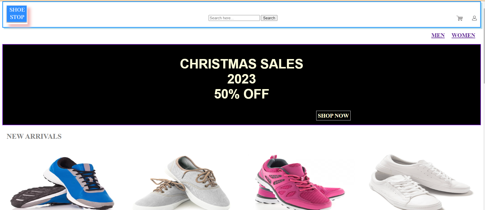
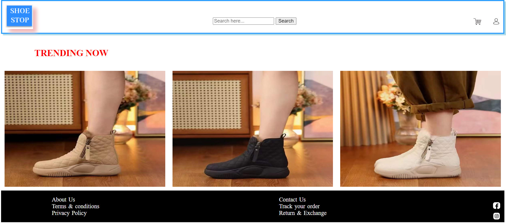

# Project Title
Ecommerce website for ShoeStop.

## Project Description
ShoeStore website offers a wide range of shoes for men and women. My primary objective in designing the website was to ensure seamless navigation for users, prioritizing a user-friendly experience to facilitate easy purchases. I have also given a special attention to creating a proper user interface, content layout and responsive design.

## Technologies Used
HTML
CSS
JavaScript

## Overview of website
 
 

## Acknowledgments
I am immensely grateful for the invaluable and continuous support extended to me by Kasun, Neil and Suchitra. Their mentorship have helped enhanced the project's quality and also helped enriched my understanding and skills in this field. 
I am truely grateful for their time, patience, and dedication, which have been pivotal in the completion of this project.